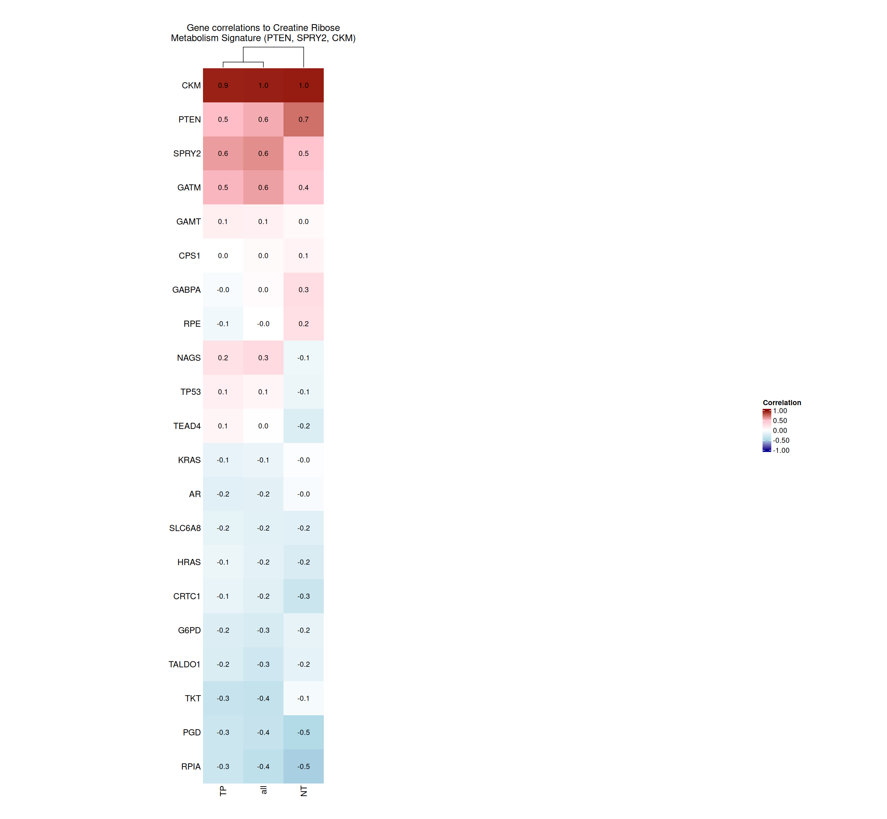
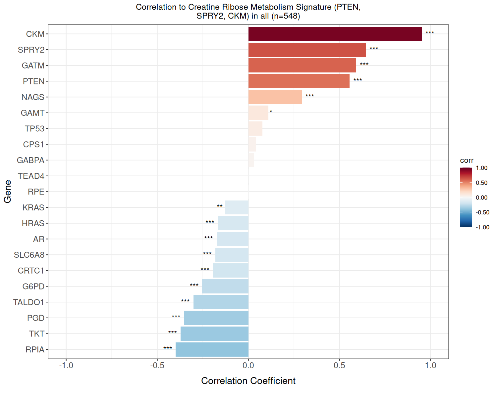
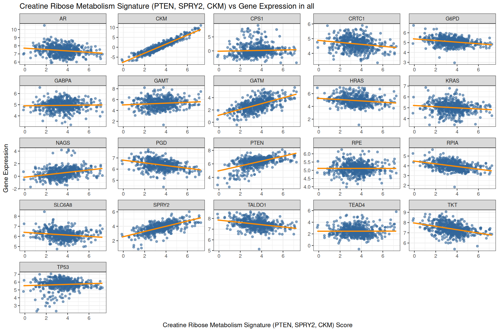

# Multi-Gene Correlations to Signature

A containerized R tool for computing Pearson correlations between a gene panel and a signature score across user-defined sample categories. Generates per-category bar plots, scatter plots, and an aggregate heatmap.

## Example Outputs

Representative run (TCGA PRAD; categories TP vs NT) with default plotting parameters:

- Heatmap (correlations by gene and category):
  
- Per-category bar plot:
  
- Per-category scatter (signature vs gene expression):
  

## Features

- Correlate gene expression against a signature score
- Per-category correlation analysis with statistical testing (FDR correction)
- Automated gene symbol updates via L2P
- Flexible input formats (CSV/TSV auto-detection)
- Comprehensive outputs: tables, bar plots, heatmap, scatter plots
- Command-line interface for batch processing
- Available as Docker and Singularity containers

## Container Images

**Docker:**
```bash
docker pull ghcr.io/nidap-community/multi-gene-correlations:latest
```

**Singularity:**
```bash
singularity pull multi-gene-correlations.sif docker://ghcr.io/nidap-community/multi-gene-correlations:latest
```

## Quick Start

### Docker

```bash
docker run --rm \
  -v /path/to/data:/data \
  -v /path/to/output:/output \
  ghcr.io/nidap-community/multi-gene-correlations:latest \
  --counts /data/counts.tsv \
  --metadata /data/metadata.csv \
  --gene_column Gene \
  --sample_column SampleID \
  --genes "GATM,GAMT,CKM,SLC6A8" \
  --category_column Tissue \
  --categories "Normal,Tumor" \
  --signature_name "MySignature" \
  --signature_genes "PTEN,SPRY2,CKM" \
  --output_dir /output
```

### Singularity

```bash
singularity run \
  --bind /path/to/data:/data \
  --bind /path/to/output:/output \
  multi-gene-correlations.sif \
  --counts /data/counts.tsv \
  --metadata /data/metadata.csv \
  --gene_column Gene \
  --sample_column SampleID \
  --genes "GATM,GAMT,CKM,SLC6A8" \
  --category_column Tissue \
  --categories "Normal,Tumor" \
  --signature_name "MySignature" \
  --signature_genes "PTEN,SPRY2,CKM" \
  --output_dir /output
```

## Required Parameters

| Parameter | Description |
|-----------|-------------|
| `--counts` | Path to normalized counts file (genes × samples). CSV or TSV format. |
| `--metadata` | Path to sample metadata file with category assignments. |
| `--gene_column` | Column name in counts file containing gene identifiers. |
| `--sample_column` | Column name in metadata containing sample identifiers. |
| `--genes` | Comma-separated list of genes to correlate (or path to file with one gene per line). |
| `--category_column` | Column name in metadata defining sample categories. |
| `--categories` | Comma-separated list of category values to analyze. |
| `--signature_genes` | Comma-separated list of genes defining the signature score (averaged). |

## Optional Parameters

| Parameter | Default | Description |
|-----------|---------|-------------|
| `--signature_name` | "Signature" | Display name for the signature in plots. |
| `--samples` | (all) | Comma-separated list to restrict analysis to specific samples. |
| `--output_dir` | `/output` | Base directory for all output files. |
| `--barplots_dir` | `<output_dir>/barplots` | Directory for correlation bar plots. |
| `--heatmap_dir` | `<output_dir>/heatmap` | Directory for the correlation heatmap. |
| `--scatter_dir` | `<output_dir>/scatter` | Directory for scatter plots. |
| `--tables_dir` | `<output_dir>/tables` | Directory for correlation tables. |
| `--margin_adjust` | `-11` | Heatmap row label margin adjustment (cm). |
| `--show_row_dendrogram` | `false` | Display row dendrogram in heatmap (`true`/`false`). |
| `--heatmap_width` | `6` | Width (cm) per heatmap column. |
| `--add_text_to_heatmap` | `true` | Print correlation values in heatmap cells. |
| `--rename_categories` | (none) | Comma-separated display labels for categories (in order). |
| `--sum_duplicates` | `false` | Sum duplicate gene rows instead of selecting maximum. |

## Input File Formats

### Counts File
Tab- or comma-separated file with genes in rows and samples in columns:

```
Gene    Sample1    Sample2    Sample3
PTEN    123.4      456.7      789.0
CKM     234.5      567.8      890.1
```

### Metadata File
Tab- or comma-separated file with sample annotations:

```
SampleID,Tissue,Patient
Sample1,Normal,P001
Sample2,Tumor,P001
Sample3,Tumor,P002
```

## Output Files

The tool generates the following outputs:

```
output/
├── tables/
│   └── pathways.csv          # Correlation coefficients, p-values, confidence intervals
├── metadata/
│   └── run_parameters.json   # Run configuration and gene mapping details
├── barplots/
│   ├── barplot_Category1.png
│   ├── barplot_Category2.png
│   └── barplot_all.png
├── heatmap/
│   └── heatmap.png           # Combined correlation heatmap
└── scatter/
    ├── scatter_Category1.png # Signature vs gene expression scatter plots
    ├── scatter_Category2.png
    └── scatter_all.png
```

## Gene List Files

Instead of comma-separated lists, you can provide file paths:

**genes.txt:**
```
GATM
GAMT
CKM
SLC6A8
```

**Usage:**
```bash
docker run --rm \
  -v /path/to/data:/data \
  -v /path/to/output:/output \
  ghcr.io/nidap-community/multi-gene-correlations:latest \
  --counts /data/counts.tsv \
  --metadata /data/metadata.csv \
  --genes /data/genes.txt \
  --signature_genes /data/signature.txt \
  ...
```

## Advanced Usage

### Custom Output Directories

Specify separate directories for each output type:

```bash
docker run --rm \
  -v /path/to/data:/data \
  -v /path/to/output:/output \
  ghcr.io/nidap-community/multi-gene-correlations:latest \
  --counts /data/counts.tsv \
  --metadata /data/metadata.csv \
  --output_dir /output \
  --barplots_dir /output/plots/bars \
  --heatmap_dir /output/plots/heatmap \
  --tables_dir /output/results \
  ...
```

### Debugging with Shell Access

**Docker:**
```bash
docker run --rm -it \
  -v /path/to/data:/data \
  --entrypoint bash \
  ghcr.io/nidap-community/multi-gene-correlations:latest
```

**Singularity:**
```bash
singularity shell \
  --bind /path/to/data:/data \
  multi-gene-correlations.sif
```

### Running on HPC with Singularity

Example SLURM job script:

```bash
#!/bin/bash
#SBATCH --job-name=correlations
#SBATCH --cpus-per-task=4
#SBATCH --mem=16G
#SBATCH --time=2:00:00

module load singularity

singularity run \
  --bind /data/project:/data \
  --bind /scratch/output:/output \
  /path/to/multi-gene-correlations.sif \
  --counts /data/counts.tsv \
  --metadata /data/metadata.csv \
  --gene_column Gene \
  --sample_column SampleID \
  --genes "GATM,GAMT,CKM,SLC6A8,AR,PTEN,SPRY2" \
  --category_column Condition \
  --categories "Control,Treatment" \
  --signature_name "Creatine" \
  --signature_genes "PTEN,SPRY2,CKM" \
  --output_dir /output
```

## Building from Source

### Clone Repository

```bash
git clone https://github.com/NIDAP-Community/multi-gene-correlations.git
cd multi-gene-correlations
```

### Build Docker Image

```bash
docker build -t multi-gene-correlations:latest .
```

### Convert to Singularity

```bash
singularity build multi-gene-correlations.sif docker-daemon://multi-gene-correlations:latest
```

## Requirements

- **R version:** 4.5.2
- **Key R packages:** dplyr, tidyr, stringr, ggplot2, ComplexHeatmap, circlize, RColorBrewer, l2p, l2psupp
- **System:** Linux container runtime (Docker or Singularity)

## Citation

This tool implements the NIDAP "Multi-Gene Correlations to Signature" template (version 14).

Template ID: `ri.vector.main.template.363cef88-16c4-433b-a709-58aa605f0958`

## License

This software is provided as-is for research use.

## Support

For issues or questions, please open an issue at:
https://github.com/NIDAP-Community/multi-gene-correlations/issues

## Version

**Current Version:** 1.0.0  
**Base Image:** rocker/r-ver:4.5.2  
**Template Version:** 14
